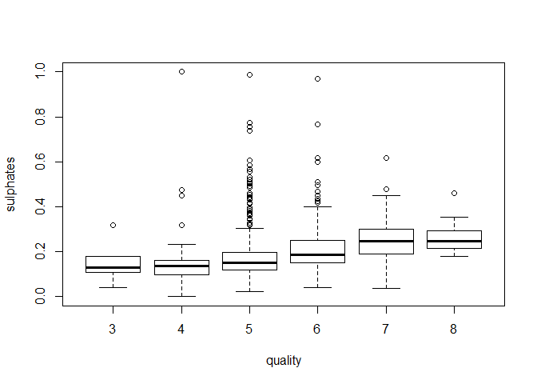
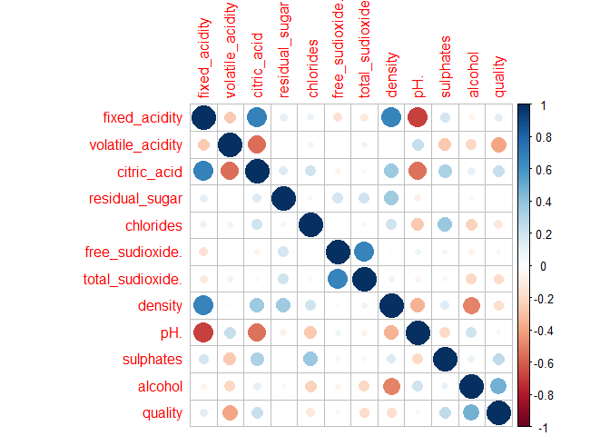

WineTasting
================
Purity
06/05/2020

\#problem statement A wine company has problems on knowing which quality
wine do they sell.Their sales are going down.They have colleted data and
gave you to make insights and tell them how to improve their sales.
\#solution

``` r
#load the dataset
Data2<- read.csv("Wine.csv")
Data3<-read.csv("Wine.csv")
```

## load the libraries

    ## Warning: package 'tidyverse' was built under R version 3.6.3

    ## -- Attaching packages ---------------------- tidyverse 1.3.0 --

    ## v tibble  2.1.3     v dplyr   0.8.3
    ## v tidyr   1.0.0     v stringr 1.4.0
    ## v readr   1.3.1     v forcats 0.4.0
    ## v purrr   0.3.4

    ## Warning: package 'readr' was built under R version 3.6.3

    ## Warning: package 'purrr' was built under R version 3.6.3

    ## -- Conflicts ------------------------- tidyverse_conflicts() --
    ## x dplyr::filter() masks stats::filter()
    ## x dplyr::lag()    masks stats::lag()

    ## Warning: package 'GGally' was built under R version 3.6.3

    ## Registered S3 method overwritten by 'GGally':
    ##   method from   
    ##   +.gg   ggplot2

    ## 
    ## Attaching package: 'GGally'

    ## The following object is masked from 'package:dplyr':
    ## 
    ##     nasa

\#Understand the data

``` r
#shape
dim(Data2)
```

    ## [1] 1599   12

``` r
str(Data2)
```

    ## 'data.frame':    1599 obs. of  12 variables:
    ##  $ fixed.acidity       : num  7.4 7.8 7.8 11.2 7.4 7.4 7.9 7.3 7.8 7.5 ...
    ##  $ volatile.acidity    : num  0.7 0.88 0.76 0.28 0.7 0.66 0.6 0.65 0.58 0.5 ...
    ##  $ citric.acid         : num  0 0 0.04 0.56 0 0 0.06 0 0.02 0.36 ...
    ##  $ residual.sugar      : num  1.9 2.6 2.3 1.9 1.9 1.8 1.6 1.2 2 6.1 ...
    ##  $ chlorides           : num  0.076 0.098 0.092 0.075 0.076 0.075 0.069 0.065 0.073 0.071 ...
    ##  $ free.sulfur.dioxide : num  11 25 15 17 11 13 15 15 9 17 ...
    ##  $ total.sulfur.dioxide: num  34 67 54 60 34 40 59 21 18 102 ...
    ##  $ density             : num  0.998 0.997 0.997 0.998 0.998 ...
    ##  $ pH                  : num  3.51 3.2 3.26 3.16 3.51 3.51 3.3 3.39 3.36 3.35 ...
    ##  $ sulphates           : num  0.56 0.68 0.65 0.58 0.56 0.56 0.46 0.47 0.57 0.8 ...
    ##  $ alcohol             : num  9.4 9.8 9.8 9.8 9.4 9.4 9.4 10 9.5 10.5 ...
    ##  $ quality             : int  5 5 5 6 5 5 5 7 7 5 ...

``` r
#if there are missing values
colSums(is.na(Data2))
```

    ##        fixed.acidity     volatile.acidity          citric.acid 
    ##                    0                    0                    0 
    ##       residual.sugar            chlorides  free.sulfur.dioxide 
    ##                    0                    0                    0 
    ## total.sulfur.dioxide              density                   pH 
    ##                    0                    0                    0 
    ##            sulphates              alcohol              quality 
    ##                    0                    0                    0

\#No missing values

``` r
#check summary 
summary(Data2)
```

    ##  fixed.acidity   volatile.acidity  citric.acid    residual.sugar  
    ##  Min.   : 4.60   Min.   :0.1200   Min.   :0.000   Min.   : 0.900  
    ##  1st Qu.: 7.10   1st Qu.:0.3900   1st Qu.:0.090   1st Qu.: 1.900  
    ##  Median : 7.90   Median :0.5200   Median :0.260   Median : 2.200  
    ##  Mean   : 8.32   Mean   :0.5278   Mean   :0.271   Mean   : 2.539  
    ##  3rd Qu.: 9.20   3rd Qu.:0.6400   3rd Qu.:0.420   3rd Qu.: 2.600  
    ##  Max.   :15.90   Max.   :1.5800   Max.   :1.000   Max.   :15.500  
    ##    chlorides       free.sulfur.dioxide total.sulfur.dioxide
    ##  Min.   :0.01200   Min.   : 1.00       Min.   :  6.00      
    ##  1st Qu.:0.07000   1st Qu.: 7.00       1st Qu.: 22.00      
    ##  Median :0.07900   Median :14.00       Median : 38.00      
    ##  Mean   :0.08747   Mean   :15.87       Mean   : 46.47      
    ##  3rd Qu.:0.09000   3rd Qu.:21.00       3rd Qu.: 62.00      
    ##  Max.   :0.61100   Max.   :72.00       Max.   :289.00      
    ##     density             pH          sulphates         alcohol     
    ##  Min.   :0.9901   Min.   :2.740   Min.   :0.3300   Min.   : 8.40  
    ##  1st Qu.:0.9956   1st Qu.:3.210   1st Qu.:0.5500   1st Qu.: 9.50  
    ##  Median :0.9968   Median :3.310   Median :0.6200   Median :10.20  
    ##  Mean   :0.9967   Mean   :3.311   Mean   :0.6581   Mean   :10.42  
    ##  3rd Qu.:0.9978   3rd Qu.:3.400   3rd Qu.:0.7300   3rd Qu.:11.10  
    ##  Max.   :1.0037   Max.   :4.010   Max.   :2.0000   Max.   :14.90  
    ##     quality     
    ##  Min.   :3.000  
    ##  1st Qu.:5.000  
    ##  Median :6.000  
    ##  Mean   :5.636  
    ##  3rd Qu.:6.000  
    ##  Max.   :8.000

``` r
#Its an all numeric variable
boxplot(Data2)
```

<!-- --> \#check for
outliers

``` r
boxplot(Data2[,1:12])
```

<!-- -->

``` r
#check correlation
cor(Data2)
```

    ##                      fixed.acidity volatile.acidity citric.acid
    ## fixed.acidity           1.00000000     -0.256130895  0.67170343
    ## volatile.acidity       -0.25613089      1.000000000 -0.55249568
    ## citric.acid             0.67170343     -0.552495685  1.00000000
    ## residual.sugar          0.11477672      0.001917882  0.14357716
    ## chlorides               0.09370519      0.061297772  0.20382291
    ## free.sulfur.dioxide    -0.15379419     -0.010503827 -0.06097813
    ## total.sulfur.dioxide   -0.11318144      0.076470005  0.03553302
    ## density                 0.66804729      0.022026232  0.36494718
    ## pH                     -0.68297819      0.234937294 -0.54190414
    ## sulphates               0.18300566     -0.260986685  0.31277004
    ## alcohol                -0.06166827     -0.202288027  0.10990325
    ## quality                 0.12405165     -0.390557780  0.22637251
    ##                      residual.sugar    chlorides free.sulfur.dioxide
    ## fixed.acidity           0.114776724  0.093705186        -0.153794193
    ## volatile.acidity        0.001917882  0.061297772        -0.010503827
    ## citric.acid             0.143577162  0.203822914        -0.060978129
    ## residual.sugar          1.000000000  0.055609535         0.187048995
    ## chlorides               0.055609535  1.000000000         0.005562147
    ## free.sulfur.dioxide     0.187048995  0.005562147         1.000000000
    ## total.sulfur.dioxide    0.203027882  0.047400468         0.667666450
    ## density                 0.355283371  0.200632327        -0.021945831
    ## pH                     -0.085652422 -0.265026131         0.070377499
    ## sulphates               0.005527121  0.371260481         0.051657572
    ## alcohol                 0.042075437 -0.221140545        -0.069408354
    ## quality                 0.013731637 -0.128906560        -0.050656057
    ##                      total.sulfur.dioxide     density          pH
    ## fixed.acidity                 -0.11318144  0.66804729 -0.68297819
    ## volatile.acidity               0.07647000  0.02202623  0.23493729
    ## citric.acid                    0.03553302  0.36494718 -0.54190414
    ## residual.sugar                 0.20302788  0.35528337 -0.08565242
    ## chlorides                      0.04740047  0.20063233 -0.26502613
    ## free.sulfur.dioxide            0.66766645 -0.02194583  0.07037750
    ## total.sulfur.dioxide           1.00000000  0.07126948 -0.06649456
    ## density                        0.07126948  1.00000000 -0.34169933
    ## pH                            -0.06649456 -0.34169933  1.00000000
    ## sulphates                      0.04294684  0.14850641 -0.19664760
    ## alcohol                       -0.20565394 -0.49617977  0.20563251
    ## quality                       -0.18510029 -0.17491923 -0.05773139
    ##                         sulphates     alcohol     quality
    ## fixed.acidity         0.183005664 -0.06166827  0.12405165
    ## volatile.acidity     -0.260986685 -0.20228803 -0.39055778
    ## citric.acid           0.312770044  0.10990325  0.22637251
    ## residual.sugar        0.005527121  0.04207544  0.01373164
    ## chlorides             0.371260481 -0.22114054 -0.12890656
    ## free.sulfur.dioxide   0.051657572 -0.06940835 -0.05065606
    ## total.sulfur.dioxide  0.042946836 -0.20565394 -0.18510029
    ## density               0.148506412 -0.49617977 -0.17491923
    ## pH                   -0.196647602  0.20563251 -0.05773139
    ## sulphates             1.000000000  0.09359475  0.25139708
    ## alcohol               0.093594750  1.00000000  0.47616632
    ## quality               0.251397079  0.47616632  1.00000000

``` r
colnames(Data2)<-c("fixed_acidity", "volatile_acidity","citric_acid","residual_sugar","chlorides","free_sudioxide ","total_sudioxide ","density","pH ","sulphates" ,"alcohol","quality")
names(Data2)
```

    ##  [1] "fixed_acidity"    "volatile_acidity" "citric_acid"     
    ##  [4] "residual_sugar"   "chlorides"        "free_sudioxide " 
    ##  [7] "total_sudioxide " "density"          "pH "             
    ## [10] "sulphates"        "alcohol"          "quality"

``` r
#normalize the data
normalize <- function(x) {
  return ((x - min(x)) / (max(x) - min(x)))
}


data_nom<-as.data.frame(lapply(Data2[1:11],normalize))


summary(data_nom)
```

    ##  fixed_acidity    volatile_acidity  citric_acid    residual_sugar   
    ##  Min.   :0.0000   Min.   :0.0000   Min.   :0.000   Min.   :0.00000  
    ##  1st Qu.:0.2212   1st Qu.:0.1849   1st Qu.:0.090   1st Qu.:0.06849  
    ##  Median :0.2920   Median :0.2740   Median :0.260   Median :0.08904  
    ##  Mean   :0.3292   Mean   :0.2793   Mean   :0.271   Mean   :0.11225  
    ##  3rd Qu.:0.4071   3rd Qu.:0.3562   3rd Qu.:0.420   3rd Qu.:0.11644  
    ##  Max.   :1.0000   Max.   :1.0000   Max.   :1.000   Max.   :1.00000  
    ##    chlorides       free_sudioxide.   total_sudioxide.     density      
    ##  Min.   :0.00000   Min.   :0.00000   Min.   :0.00000   Min.   :0.0000  
    ##  1st Qu.:0.09683   1st Qu.:0.08451   1st Qu.:0.05654   1st Qu.:0.4060  
    ##  Median :0.11185   Median :0.18310   Median :0.11307   Median :0.4905  
    ##  Mean   :0.12599   Mean   :0.20951   Mean   :0.14300   Mean   :0.4902  
    ##  3rd Qu.:0.13022   3rd Qu.:0.28169   3rd Qu.:0.19788   3rd Qu.:0.5701  
    ##  Max.   :1.00000   Max.   :1.00000   Max.   :1.00000   Max.   :1.0000  
    ##       pH.           sulphates         alcohol      
    ##  Min.   :0.0000   Min.   :0.0000   Min.   :0.0000  
    ##  1st Qu.:0.3701   1st Qu.:0.1317   1st Qu.:0.1692  
    ##  Median :0.4488   Median :0.1737   Median :0.2769  
    ##  Mean   :0.4497   Mean   :0.1965   Mean   :0.3112  
    ##  3rd Qu.:0.5197   3rd Qu.:0.2395   3rd Qu.:0.4154  
    ##  Max.   :1.0000   Max.   :1.0000   Max.   :1.0000

\#univariate eda

``` r
hist(
  Data2$fixed_acidity,
  main = "Fixed acidity distribution",
  col = "red",
  xlab = "fixed acidy",
  ylab = "count"
)
```

<!-- -->

``` r
hist(
  Data2$volatile_acidity,
  main = "volatile acidity distribution",
  col = "red",
  xlab = "volatile acidy",
  ylab = "count"
)
```

<!-- -->

``` r
hist(
  Data2$citric_acid,
  main = "citric distribution",
  col = "red",
  xlab = "citric acidy",
  ylab = "count"
)
```

<!-- -->

``` r
hist(
  Data2$residual_sugar,
  main = "residual_sugar distribution",
  col = "red",
  xlab = "residual sugar",
  ylab = "count"
)
```

<!-- -->

``` r
hist(
  Data2$chlorides,
  main = "chlorides distribution",
  col = "red",
  xlab = "chlorides",
  ylab = "count"
)
```

<!-- -->

``` r
hist(
  Data2$`free_sudioxide `,
  main = "free suphur dioxide distribution",
  col = "red",
  xlab = "free sulphur ",
  ylab = "count"
)
```

<!-- -->

``` r
hist(
  Data2$`total_sudioxide `,
  main = "total sulphur dioxide distribution",
  col = "red",
  xlab = "total dioxide",
  ylab = "count"
)
```

<!-- -->

``` r
hist(
  Data2$density,
  main = " distribution",
  col = "red",
  xlab = "density",
  ylab = "count"
)
```

<!-- -->

``` r
hist(
  Data2$`pH `,
  main = "ph distribution",
  col = "red",
  xlab = "PH",
  ylab = "count"
)
```

<!-- -->

``` r
hist(
  Data2$sulphates,
  main = "sulphates distribution",
  col = "red",
  xlab = "sulphates",
  ylab = "count"
)
```

<!-- -->

``` r
hist(
  Data2$alcohol,
  main = "alcohol distribution",
  col = "red",
  xlab = "alcohol",
  ylab = "count"
)
```

<!-- -->

\#check for outliers

``` r
quality = Data3$quality
Data1<-cbind(data_nom,quality)
head(Data1)
```

    ##   fixed_acidity volatile_acidity citric_acid residual_sugar chlorides
    ## 1     0.2477876        0.3972603        0.00     0.06849315 0.1068447
    ## 2     0.2831858        0.5205479        0.00     0.11643836 0.1435726
    ## 3     0.2831858        0.4383562        0.04     0.09589041 0.1335559
    ## 4     0.5840708        0.1095890        0.56     0.06849315 0.1051753
    ## 5     0.2477876        0.3972603        0.00     0.06849315 0.1068447
    ## 6     0.2477876        0.3698630        0.00     0.06164384 0.1051753
    ##   free_sudioxide. total_sudioxide.   density       pH. sulphates   alcohol
    ## 1       0.1408451       0.09893993 0.5675477 0.6062992 0.1377246 0.1538462
    ## 2       0.3380282       0.21554770 0.4941263 0.3622047 0.2095808 0.2153846
    ## 3       0.1971831       0.16961131 0.5088106 0.4094488 0.1916168 0.2153846
    ## 4       0.2253521       0.19081272 0.5822320 0.3307087 0.1497006 0.2153846
    ## 5       0.1408451       0.09893993 0.5675477 0.6062992 0.1377246 0.1538462
    ## 6       0.1690141       0.12014134 0.5675477 0.6062992 0.1377246 0.1538462
    ##   quality
    ## 1       5
    ## 2       5
    ## 3       5
    ## 4       6
    ## 5       5
    ## 6       5

``` r
str(Data1)
```

    ## 'data.frame':    1599 obs. of  12 variables:
    ##  $ fixed_acidity   : num  0.248 0.283 0.283 0.584 0.248 ...
    ##  $ volatile_acidity: num  0.397 0.521 0.438 0.11 0.397 ...
    ##  $ citric_acid     : num  0 0 0.04 0.56 0 0 0.06 0 0.02 0.36 ...
    ##  $ residual_sugar  : num  0.0685 0.1164 0.0959 0.0685 0.0685 ...
    ##  $ chlorides       : num  0.107 0.144 0.134 0.105 0.107 ...
    ##  $ free_sudioxide. : num  0.141 0.338 0.197 0.225 0.141 ...
    ##  $ total_sudioxide.: num  0.0989 0.2155 0.1696 0.1908 0.0989 ...
    ##  $ density         : num  0.568 0.494 0.509 0.582 0.568 ...
    ##  $ pH.             : num  0.606 0.362 0.409 0.331 0.606 ...
    ##  $ sulphates       : num  0.138 0.21 0.192 0.15 0.138 ...
    ##  $ alcohol         : num  0.154 0.215 0.215 0.215 0.154 ...
    ##  $ quality         : int  5 5 5 6 5 5 5 7 7 5 ...

``` r
head(Data1)
```

    ##   fixed_acidity volatile_acidity citric_acid residual_sugar chlorides
    ## 1     0.2477876        0.3972603        0.00     0.06849315 0.1068447
    ## 2     0.2831858        0.5205479        0.00     0.11643836 0.1435726
    ## 3     0.2831858        0.4383562        0.04     0.09589041 0.1335559
    ## 4     0.5840708        0.1095890        0.56     0.06849315 0.1051753
    ## 5     0.2477876        0.3972603        0.00     0.06849315 0.1068447
    ## 6     0.2477876        0.3698630        0.00     0.06164384 0.1051753
    ##   free_sudioxide. total_sudioxide.   density       pH. sulphates   alcohol
    ## 1       0.1408451       0.09893993 0.5675477 0.6062992 0.1377246 0.1538462
    ## 2       0.3380282       0.21554770 0.4941263 0.3622047 0.2095808 0.2153846
    ## 3       0.1971831       0.16961131 0.5088106 0.4094488 0.1916168 0.2153846
    ## 4       0.2253521       0.19081272 0.5822320 0.3307087 0.1497006 0.2153846
    ## 5       0.1408451       0.09893993 0.5675477 0.6062992 0.1377246 0.1538462
    ## 6       0.1690141       0.12014134 0.5675477 0.6062992 0.1377246 0.1538462
    ##   quality
    ## 1       5
    ## 2       5
    ## 3       5
    ## 4       6
    ## 5       5
    ## 6       5

``` r
boxplot(sulphates~quality,data = Data1)
```

<!-- -->

``` r
#par(mfrow=c(2,5))
for (i in 1:length(Data1)) {
        boxplot(Data1[,i], main=names(Data1[i]), type="l")

}
```

<!-- --><!-- --><!-- --><!-- --><!-- --><!-- --><!-- --><!-- --><!-- --><!-- --><!-- --><!-- -->
\#each variable has outliers

``` r
#par(mfrow=c(2,5))
for (i in 1:length(Data1)) {
        hist(Data1[,i],xlab =names(Data1[,i]) )

}
```

<!-- --><!-- --><!-- --><!-- --><!-- --><!-- --><!-- --><!-- --><!-- --><!-- --><!-- --><!-- -->

``` r
library(psych)
```

    ## Warning: package 'psych' was built under R version 3.6.3

    ## 
    ## Attaching package: 'psych'

    ## The following objects are masked from 'package:ggplot2':
    ## 
    ##     %+%, alpha

``` r
multi.hist(Data1,density=TRUE,freq=T,bcol = "red",dcol=c("black","black"),dlty=c("dashed","dotted",main =NULL,breaks = 21))
```

<!-- -->

``` r
#multi hist is an easier way of checking distribution
?multi.hist
```

    ## starting httpd help server ...

    ##  done

\#above you can easily check distribution of each varible

``` r
library(outliers)
```

    ## 
    ## Attaching package: 'outliers'

    ## The following object is masked from 'package:psych':
    ## 
    ##     outlier

``` r
rm.outlier(Data1$sulphates, fill = FALSE, median = FALSE, opposite = FALSE)
```

    ##    [1] 0.13772455 0.20958084 0.19161677 0.14970060 0.13772455 0.13772455
    ##    [7] 0.07784431 0.08383234 0.14371257 0.28143713 0.12574850 0.28143713
    ##   [13] 0.11377246 0.73652695 0.32934132 0.35928144 0.25149701 0.56886228
    ##   [19] 0.10179641 0.44910180 0.11976048 0.19161677 0.34730539 0.11976048
    ##   [25] 0.17964072 0.13772455 0.15568862 0.34730539 0.13173653 0.15568862
    ##   [31] 0.12574850 0.14371257 0.19760479 0.11377246 0.13173653 0.13173653
    ##   [37] 0.16167665 0.23952096 0.08982036 0.29940120 0.29940120 0.10778443
    ##   [43] 0.34131737 0.52095808 0.11377246 0.13772455 0.23952096 0.14970060
    ##   [49] 0.13772455 0.14970060 0.24550898 0.17964072 0.18562874 0.13772455
    ##   [55] 0.17964072 0.11976048 0.17964072 0.26347305 0.15568862 0.12574850
    ##   [61] 0.18562874 0.22754491 0.17365269 0.14371257 0.03592814 0.03592814
    ##   [67] 0.14970060 0.14970060 0.27544910 0.37125749 0.12574850 0.08982036
    ##   [73] 0.08982036 0.11976048 0.29341317 0.19760479 0.19760479 0.13173653
    ##   [79] 0.11377246 0.47305389 0.13772455 0.56886228 0.14371257 0.48502994
    ##   [85] 0.26946108 0.15568862 0.97005988 0.18562874 0.53293413 0.11976048
    ##   [91] 0.12574850 0.97005988 0.98802395 0.18562874 0.08982036 0.16167665
    ##   [97] 0.13772455 0.17964072 0.13772455 0.15568862 0.16766467 0.13772455
    ##  [103] 0.15568862 0.10778443 0.08982036 0.10778443 0.58682635 0.27544910
    ##  [109] 0.28143713 0.21556886 0.35928144 0.19760479 0.19760479 0.20359281
    ##  [115] 0.35928144 0.17964072 0.16766467 0.10179641 0.16167665 0.12574850
    ##  [121] 0.14371257 0.16167665 0.11377246 0.11976048 0.08982036 0.22155689
    ##  [127] 0.09580838 0.08982036 0.35329341 0.14371257 0.19760479 0.17964072
    ##  [133] 0.17964072 0.14970060 0.13173653 0.29341317 0.26347305 0.18562874
    ##  [139] 0.12574850 0.12574850 0.29341317 0.26347305 0.27544910 0.14970060
    ##  [145] 0.27544910 0.17365269 0.11377246 0.28143713 0.14970060 0.16766467
    ##  [151] 0.11976048 0.12574850 0.12574850 0.23353293 0.22754491 0.23353293
    ##  [157] 0.22754491 0.10179641 0.14371257 0.13772455 0.44910180 0.13772455
    ##  [163] 0.09580838 0.09580838 0.17365269 0.11377246 0.08982036 0.13173653
    ##  [169] 0.75449102 0.00000000 0.16766467 0.16766467 0.14371257 0.08383234
    ##  [175] 0.26946108 0.08383234 0.16766467 0.13772455 0.15568862 0.15568862
    ##  [181] 0.41317365 0.11377246 0.14970060 0.14970060 0.11976048 0.13173653
    ##  [187] 0.09580838 0.13173653 0.13173653 0.17365269 0.17365269 0.16766467
    ##  [193] 0.13173653 0.13173653 0.12574850 0.15568862 0.38323353 0.31137725
    ##  [199] 0.05988024 0.29341317 0.41916168 0.27544910 0.13173653 0.13772455
    ##  [205] 0.26347305 0.26347305 0.11976048 0.20359281 0.32934132 0.31736527
    ##  [211] 0.13772455 0.20359281 0.05988024 0.22754491 0.25748503 0.14371257
    ##  [217] 0.13173653 0.12574850 0.16167665 0.15568862 0.14371257 0.16167665
    ##  [223] 0.16167665 0.14371257 0.14970060 0.76646707 0.17964072 0.14970060
    ##  [229] 0.10179641 0.17365269 0.11377246 0.22155689 0.10179641 0.13173653
    ##  [235] 0.14970060 0.14970060 0.14970060 0.14970060 0.13173653 0.45508982
    ##  [241] 0.22754491 0.09580838 0.30538922 0.30538922 0.37724551 0.11377246
    ##  [247] 0.07185629 0.08982036 0.37724551 0.26946108 0.22155689 0.11976048
    ##  [253] 0.15568862 0.22155689 0.14371257 0.17365269 0.20359281 0.55688623
    ##  [259] 0.28143713 0.19161677 0.16167665 0.14371257 0.20359281 0.32335329
    ##  [265] 0.23353293 0.23353293 0.31736527 0.34730539 0.38323353 0.20359281
    ##  [271] 0.38323353 0.26946108 0.18562874 0.26347305 0.20359281 0.34730539
    ##  [277] 0.38323353 0.29341317 0.26347305 0.29341317 0.44910180 0.14371257
    ##  [283] 0.26347305 0.22754491 0.22754491 0.25748503 0.22155689 0.31736527
    ##  [289] 0.37125749 0.31736527 0.22754491 0.18562874 0.16167665 0.28742515
    ##  [295] 0.18562874 0.11377246 0.23952096 0.28143713 0.22754491 0.15568862
    ##  [301] 0.18562874 0.23353293 0.12574850 0.11377246 0.15568862 0.11377246
    ##  [307] 0.17365269 0.17964072 0.11976048 0.15568862 0.12574850 0.17964072
    ##  [313] 0.11976048 0.20958084 0.19161677 0.19161677 0.18562874 0.22754491
    ##  [319] 0.18562874 0.22754491 0.17365269 0.17964072 0.22155689 0.21556886
    ##  [325] 0.21556886 0.24550898 0.29940120 0.20359281 0.17365269 0.19760479
    ##  [331] 0.19760479 0.12574850 0.11377246 0.24550898 0.30538922 0.22155689
    ##  [337] 0.18562874 0.40119760 0.61676647 0.50898204 0.32335329 0.25149701
    ##  [343] 0.25149701 0.26946108 0.28742515 0.33532934 0.35928144 0.35329341
    ##  [349] 0.31736527 0.38922156 0.29940120 0.23952096 0.26347305 0.15568862
    ##  [355] 0.16766467 0.32934132 0.25149701 0.31137725 0.20958084 0.22155689
    ##  [361] 0.34730539 0.13772455 0.32335329 0.23952096 0.35928144 0.23952096
    ##  [367] 0.21556886 0.18562874 0.47904192 0.26946108 0.32335329 0.42514970
    ##  [373] 0.17964072 0.28742515 0.29940120 0.46706587 0.47904192 0.39520958
    ##  [379] 0.22155689 0.28143713 0.28143713 0.28143713 0.28143713 0.24550898
    ##  [385] 0.25748503 0.24550898 0.12574850 0.24550898 0.22155689 0.29341317
    ##  [391] 0.28143713 0.10778443 0.12574850 0.14371257 0.16167665 0.11976048
    ##  [397] 0.19161677 0.19161677 0.13173653 0.11976048 0.08383234 0.16766467
    ##  [403] 0.17964072 0.16766467 0.25748503 0.19161677 0.17964072 0.22155689
    ##  [409] 0.14371257 0.17365269 0.17365269 0.18562874 0.29341317 0.16766467
    ##  [415] 0.44311377 0.19760479 0.08982036 0.25748503 0.20958084 0.23952096
    ##  [421] 0.13772455 0.06586826 0.34131737 0.06586826 0.13772455 0.09580838
    ##  [427] 0.13772455 0.16167665 0.16167665 0.34131737 0.13772455 0.19161677
    ##  [433] 0.09580838 0.33532934 0.09580838 0.13772455 0.19760479 0.33532934
    ##  [439] 0.16167665 0.29341317 0.20958084 0.20958084 0.17964072 0.30538922
    ##  [445] 0.13772455 0.23952096 0.23353293 0.13772455 0.16766467 0.16766467
    ##  [451] 0.43712575 0.17964072 0.24550898 0.17964072 0.21556886 0.14970060
    ##  [457] 0.14970060 0.24550898 0.14371257 0.16766467 0.16766467 0.16766467
    ##  [463] 0.11976048 0.22155689 0.34730539 0.23353293 0.27544910 0.17365269
    ##  [469] 0.14970060 0.16766467 0.22754491 0.29341317 0.27544910 0.33532934
    ##  [475] 0.16167665 0.22155689 0.43712575 0.16167665 0.22155689 0.19760479
    ##  [481] 0.35329341 0.43113772 0.43712575 0.19760479 0.08383234 0.08383234
    ##  [487] 0.05389222 0.35329341 0.25149701 0.20359281 0.27544910 0.34131737
    ##  [493] 0.24550898 0.13173653 0.19161677 0.19161677 0.27544910 0.19161677
    ##  [499] 0.24550898 0.19161677 0.31137725 0.31137725 0.42514970 0.43113772
    ##  [505] 0.26946108 0.41317365 0.22754491 0.17964072 0.20958084 0.16766467
    ##  [511] 0.17964072 0.28742515 0.19760479 0.19760479 0.48502994 0.24550898
    ##  [517] 0.17964072 0.20958084 0.26946108 0.34131737 0.18562874 0.39520958
    ##  [523] 0.13173653 0.18562874 0.20359281 0.26946108 0.26347305 0.25149701
    ##  [529] 0.14371257 0.32335329 0.16766467 0.16766467 0.19760479 0.13772455
    ##  [535] 0.32335329 0.14371257 0.26347305 0.19760479 0.17365269 0.20359281
    ##  [541] 0.23952096 0.15568862 0.23353293 0.27544910 0.15568862 0.26946108
    ##  [547] 0.31736527 0.25149701 0.16766467 0.13772455 0.23952096 0.24550898
    ##  [553] 0.17365269 0.24550898 0.24550898 0.13772455 0.24550898 0.13772455
    ##  [559] 0.20958084 0.14371257 0.14970060 0.16766467 0.16766467 0.20958084
    ##  [565] 0.14371257 0.16167665 0.16167665 0.27544910 0.14371257 0.34730539
    ##  [571] 0.14371257 0.16766467 0.13772455 0.22155689 0.28143713 0.11377246
    ##  [577] 0.16167665 0.16167665 0.10778443 0.06586826 0.06586826 0.05988024
    ##  [583] 0.19760479 0.25748503 0.19760479 0.41317365 0.15568862 0.24550898
    ##  [589] 0.24550898 0.14371257 0.10179641 0.14371257 0.14970060 0.11976048
    ##  [595] 0.14371257 0.16167665 0.17964072 0.08982036 0.22155689 0.08383234
    ##  [601] 0.13772455 0.11377246 0.13772455 0.17365269 0.15568862 0.27544910
    ##  [607] 0.11976048 0.18562874 0.11377246 0.12574850 0.12574850 0.16167665
    ##  [613] 0.24550898 0.61676647 0.14371257 0.14371257 0.35928144 0.22155689
    ##  [619] 0.28143713 0.16766467 0.17365269 0.13173653 0.37724551 0.23353293
    ##  [625] 0.23353293 0.09580838 0.09580838 0.16167665 0.16766467 0.16167665
    ##  [631] 0.17964072 0.14371257 0.18562874 0.14970060 0.13173653 0.11976048
    ##  [637] 0.11976048 0.19161677 0.61676647 0.17365269 0.17964072 0.17365269
    ##  [643] 0.17964072 0.17365269 0.21556886 0.17964072 0.14970060 0.20359281
    ##  [649] 0.14371257 0.10179641 0.20359281 0.30538922 0.12574850 0.07784431
    ##  [655] 0.16766467 0.10179641 0.20958084 0.28742515 0.14371257 0.28742515
    ##  [661] 0.18562874 0.22155689 0.27544910 0.19760479 0.13772455 0.16167665
    ##  [667] 0.19760479 0.14371257 0.19760479 0.14970060 0.11377246 0.11976048
    ##  [673] 0.11377246 0.20359281 0.19161677 0.20359281 0.08982036 0.11976048
    ##  [679] 0.12574850 0.09580838 0.09580838 0.12574850 0.13772455 0.08982036
    ##  [685] 0.13772455 0.16167665 0.15568862 0.08383234 0.43113772 0.12574850
    ##  [691] 0.12574850 0.50299401 0.17365269 0.16766467 0.17365269 0.20359281
    ##  [697] 0.20359281 0.11976048 0.17365269 0.14371257 0.20359281 0.20359281
    ##  [703] 0.22155689 0.12574850 0.09580838 0.08383234 0.10778443 0.16766467
    ##  [709] 0.19760479 0.14371257 0.16766467 0.07185629 0.07784431 0.10778443
    ##  [715] 0.08982036 0.07784431 0.14371257 0.06586826 0.12574850 0.06586826
    ##  [721] 0.11976048 0.15568862 0.77245509 0.16167665 0.13173653 0.23353293
    ##  [727] 0.20958084 0.20958084 0.09580838 0.20359281 0.11377246 0.08383234
    ##  [733] 0.16167665 0.17365269 0.10179641 0.10179641 0.19161677 0.13772455
    ##  [739] 0.16167665 0.20958084 0.14371257 0.19161677 0.11976048 0.10778443
    ##  [745] 0.23952096 0.08383234 0.08982036 0.23353293 0.23952096 0.13173653
    ##  [751] 0.13173653 0.16766467 0.13173653 0.43712575 0.05988024 0.07784431
    ##  [757] 0.10179641 0.10179641 0.11377246 0.14371257 0.05389222 0.11976048
    ##  [763] 0.05389222 0.13173653 0.12574850 0.12574850 0.17365269 0.11976048
    ##  [769] 0.12574850 0.11976048 0.13173653 0.13173653 0.35329341 0.34730539
    ##  [775] 0.07784431 0.16167665 0.15568862 0.16766467 0.16167665 0.16167665
    ##  [781] 0.19161677 0.11976048 0.19161677 0.15568862 0.10179641 0.10179641
    ##  [787] 0.13772455 0.13772455 0.11377246 0.20958084 0.12574850 0.16167665
    ##  [793] 0.13772455 0.11976048 0.50898204 0.24550898 0.28742515 0.11377246
    ##  [799] 0.11377246 0.10778443 0.06586826 0.36526946 0.19760479 0.14371257
    ##  [805] 0.22155689 0.22754491 0.22155689 0.31736527 0.13173653 0.08383234
    ##  [811] 0.20958084 0.22754491 0.14970060 0.25748503 0.22754491 0.14970060
    ##  [817] 0.23952096 0.07185629 0.12574850 0.16167665 0.24550898 0.18562874
    ##  [823] 0.18562874 0.11976048 0.09580838 0.18562874 0.09580838 0.24550898
    ##  [829] 0.26347305 0.13173653 0.26347305 0.31736527 0.31736527 0.08383234
    ##  [835] 0.10778443 0.03592814 0.03592814 0.29940120 0.08383234 0.26347305
    ##  [841] 0.17964072 0.23353293 0.17365269 0.29940120 0.19760479 0.19760479
    ##  [847] 0.22155689 0.19760479 0.19760479 0.13173653 0.13173653 0.44311377
    ##  [853] 0.23952096 0.23952096 0.22754491 0.23952096 0.26946108 0.20359281
    ##  [859] 0.29341317 0.12574850 0.16167665 0.06586826 0.11976048 0.12574850
    ##  [865] 0.12574850 0.29940120 0.30538922 0.29341317 0.18562874 0.14371257
    ##  [871] 0.14371257 0.12574850 0.14970060 0.19161677 0.27544910 0.14970060
    ##  [877] 0.14371257 0.10179641 0.13173653 0.09580838 0.19161677 0.26946108
    ##  [883] 0.13173653 0.10179641 0.18562874 0.19161677 0.27544910 0.13772455
    ##  [889] 0.20958084 0.14970060 0.14371257 0.19161677 0.14371257 0.14970060
    ##  [895] 0.14970060 0.26347305 0.14970060 0.26347305 0.09580838 0.21556886
    ##  [901] 0.21556886 0.21556886 0.15568862 0.15568862 0.15568862 0.22754491
    ##  [907] 0.12574850 0.15568862 0.11377246 0.14371257 0.16167665 0.17365269
    ##  [913] 0.18562874 0.11377246 0.20359281 0.16766467 0.18562874 0.23353293
    ##  [919] 0.33532934 0.13772455 0.23353293 0.33532934 0.18562874 0.28143713
    ##  [925] 0.32335329 0.34131737 0.15568862 0.28143713 0.23952096 0.23952096
    ##  [931] 0.19161677 0.15568862 0.19161677 0.23952096 0.23353293 0.23353293
    ##  [937] 0.16167665 0.23353293 0.12574850 0.25748503 0.11377246 0.18562874
    ##  [943] 0.16167665 0.18562874 0.27544910 0.39520958 0.17365269 0.25748503
    ##  [949] 0.25748503 0.25748503 0.17365269 0.20958084 0.21556886 0.12574850
    ##  [955] 0.20359281 0.17365269 0.14970060 0.22754491 0.16766467 0.31137725
    ##  [961] 0.17365269 0.21556886 0.21556886 0.31137725 0.31736527 0.14970060
    ##  [967] 0.08982036 0.16167665 0.16766467 0.32335329 0.32335329 0.19161677
    ##  [973] 0.17964072 0.17365269 0.11377246 0.11377246 0.10179641 0.09580838
    ##  [979] 0.17964072 0.22754491 0.17365269 0.29341317 0.22754491 0.17964072
    ##  [985] 0.14970060 0.13173653 0.10179641 0.09580838 0.10778443 0.09580838
    ##  [991] 0.08982036 0.08982036 0.08982036 0.05988024 0.17365269 0.17964072
    ##  [997] 0.17964072 0.08982036 0.11976048 0.23353293 0.29341317 0.30538922
    ## [1003] 0.13173653 0.12574850 0.13173653 0.30538922 0.30538922 0.22155689
    ## [1009] 0.20958084 0.13173653 0.13173653 0.08982036 0.14970060 0.14970060
    ## [1015] 0.30538922 0.25149701 0.06586826 0.06586826 0.16766467 0.11976048
    ## [1021] 0.11976048 0.12574850 0.13173653 0.13772455 0.16167665 0.13772455
    ## [1027] 0.11377246 0.12574850 0.13772455 0.13173653 0.14970060 0.11976048
    ## [1033] 0.15568862 0.08383234 0.19161677 0.15568862 0.13772455 0.26347305
    ## [1039] 0.29940120 0.20359281 0.18562874 0.29940120 0.28742515 0.17365269
    ## [1045] 0.14970060 0.17365269 0.18562874 0.26946108 0.26347305 0.18562874
    ## [1051] 0.60479042 0.13173653 0.26347305 0.17365269 0.17365269 0.15568862
    ## [1057] 0.14371257 0.25748503 0.15568862 0.22155689 0.21556886 0.18562874
    ## [1063] 0.17964072 0.14371257 0.16167665 0.23353293 0.29940120 0.29940120
    ## [1069] 0.17365269 0.33532934 0.14970060 0.14970060 0.14970060 0.14970060
    ## [1075] 0.31736527 0.23952096 0.14970060 0.14970060 0.10778443 0.10778443
    ## [1081] 0.10778443 0.15568862 0.26347305 0.15568862 0.09580838 0.19760479
    ## [1087] 0.21556886 0.25748503 0.25748503 0.17964072 0.16167665 0.15568862
    ## [1093] 0.31736527 0.09580838 0.10179641 0.09580838 0.11377246 0.28742515
    ## [1099] 0.11377246 0.26946108 0.17964072 0.12574850 0.17964072 0.19760479
    ## [1105] 0.16167665 0.12574850 0.31137725 0.09580838 0.25748503 0.18562874
    ## [1111] 0.18562874 0.22754491 0.15568862 0.19760479 0.16167665 0.16167665
    ## [1117] 0.16167665 0.11976048 0.14970060 0.23353293 0.13173653 0.08982036
    ## [1123] 0.19161677 0.17365269 0.15568862 0.12574850 0.16167665 0.20958084
    ## [1129] 0.21556886 0.17964072 0.06586826 0.32934132 0.20958084 0.24550898
    ## [1135] 0.16167665 0.25748503 0.25748503 0.14970060 0.18562874 0.19161677
    ## [1141] 0.31137725 0.19161677 0.29341317 0.17365269 0.28742515 0.32335329
    ## [1147] 0.09580838 0.19760479 0.11377246 0.25748503 0.19161677 0.11976048
    ## [1153] 0.19760479 0.20958084 0.11976048 0.25748503 0.32335329 0.49700599
    ## [1159] 0.20359281 0.23353293 0.25149701 0.22754491 0.20359281 0.20359281
    ## [1165] 0.46107784 0.38922156 0.32934132 0.13772455 0.17365269 0.20359281
    ## [1171] 0.20958084 0.24550898 0.17365269 0.17365269 0.22155689 0.10179641
    ## [1177] 0.19760479 0.23952096 0.28742515 0.28742515 0.07784431 0.31736527
    ## [1183] 0.16167665 0.22155689 0.07784431 0.10179641 0.07784431 0.22155689
    ## [1189] 0.06586826 0.14371257 0.10778443 0.28143713 0.10778443 0.15568862
    ## [1195] 0.16167665 0.14970060 0.12574850 0.27544910 0.14970060 0.12574850
    ## [1201] 0.12574850 0.21556886 0.13173653 0.31137725 0.31137725 0.31137725
    ## [1207] 0.36526946 0.31137725 0.32335329 0.17365269 0.17365269 0.17365269
    ## [1213] 0.25149701 0.08982036 0.13772455 0.21556886 0.28742515 0.21556886
    ## [1219] 0.29940120 0.26347305 0.26347305 0.07784431 0.25748503 0.29341317
    ## [1225] 0.10778443 0.08383234 0.23353293 0.23952096 0.18562874 0.26946108
    ## [1231] 0.17365269 0.18562874 0.09580838 0.04191617 0.13772455 0.18562874
    ## [1237] 0.04191617 0.07784431 0.13772455 0.04191617 0.15568862 0.16167665
    ## [1243] 0.17365269 0.12574850 0.20958084 0.08982036 0.20958084 0.25149701
    ## [1249] 0.16766467 0.16766467 0.15568862 0.14970060 0.14970060 0.21556886
    ## [1255] 0.07185629 0.05389222 0.22155689 0.17964072 0.17964072 0.49101796
    ## [1261] 0.13173653 0.14970060 0.07784431 0.23353293 0.16167665 0.16167665
    ## [1267] 0.32335329 0.13173653 0.29341317 0.25149701 0.14371257 0.11976048
    ## [1273] 0.05988024 0.11976048 0.12574850 0.13772455 0.16167665 0.12574850
    ## [1279] 0.14371257 0.18562874 0.18562874 0.20958084 0.17964072 0.13772455
    ## [1285] 0.14371257 0.12574850 0.02395210 0.50299401 0.50299401 0.15568862
    ## [1291] 0.25149701 0.20359281 0.09580838 0.25149701 0.07185629 0.07185629
    ## [1297] 0.16766467 0.13772455 0.04191617 0.16766467 0.24550898 0.28143713
    ## [1303] 0.19760479 0.06586826 0.11976048 0.17365269 0.11377246 0.17365269
    ## [1309] 0.16766467 0.11976048 0.15568862 0.08383234 0.12574850 0.11976048
    ## [1315] 0.14970060 0.15568862 0.21556886 0.14970060 0.59880240 0.19760479
    ## [1321] 0.15568862 0.13173653 0.29341317 0.16167665 0.16167665 0.16167665
    ## [1327] 0.16167665 0.11377246 0.13772455 0.13772455 0.07784431 0.05988024
    ## [1333] 0.10778443 0.11377246 0.19760479 0.07185629 0.07185629 0.07185629
    ## [1339] 0.12574850 0.12574850 0.12574850 0.10778443 0.12574850 0.11976048
    ## [1345] 0.11976048 0.13772455 0.03592814 0.03592814 0.11377246 0.14371257
    ## [1351] 0.10778443 0.07784431 0.07784431 0.11377246 0.06586826 0.06586826
    ## [1357] 0.15568862 0.10179641 0.19161677 0.13772455 0.12574850 0.19161677
    ## [1363] 0.08982036 0.11976048 0.17365269 0.10179641 0.50898204 0.10179641
    ## [1369] 0.02395210 0.50299401 0.41916168 0.50299401 0.07185629 0.10778443
    ## [1375] 0.11377246 0.07784431 0.17365269 0.10778443 0.17365269 0.17365269
    ## [1381] 0.07185629 0.09580838 0.09580838 0.10179641 0.05389222 0.14970060
    ## [1387] 0.14970060 0.20958084 0.11976048 0.15568862 0.14970060 0.08982036
    ## [1393] 0.08982036 0.08982036 0.19161677 0.19161677 0.11377246 0.17365269
    ## [1399] 0.23353293 0.10778443 0.10778443 0.29341317 0.46107784 0.17365269
    ## [1405] 0.34131737 0.36526946 0.35928144 0.40718563 0.35928144 0.06586826
    ## [1411] 0.23952096 0.36526946 0.34131737 0.26946108 0.30538922 0.26946108
    ## [1417] 0.26347305 0.07784431 0.07185629 0.07784431 0.14970060 0.30538922
    ## [1423] 0.20359281 0.22155689 0.22155689 0.22754491 0.14970060 0.17964072
    ## [1429] 0.35928144 0.17365269 0.12574850 0.31137725 0.24550898 0.26347305
    ## [1435] 0.26347305 0.19161677 0.12574850 0.08383234 0.20958084 0.23952096
    ## [1441] 0.11377246 0.25149701 0.09580838 0.20958084 0.11377246 0.25149701
    ## [1447] 0.24550898 0.23952096 0.25748503 0.23952096 0.26946108 0.25748503
    ## [1453] 0.14970060 0.21556886 0.17964072 0.10179641 0.14970060 0.16167665
    ## [1459] 0.28143713 0.20958084 0.16766467 0.14970060 0.11976048 0.20359281
    ## [1465] 0.20359281 0.19161677 0.14371257 0.19161677 0.13173653 0.08383234
    ## [1471] 0.11377246 0.27544910 0.12574850 0.25149701 0.32934132 0.25149701
    ## [1477] 0.32934132 0.11377246 0.20958084 0.17365269 0.20958084 0.14371257
    ## [1483] 0.16766467 0.18562874 0.13173653 0.16167665 0.26946108 0.14970060
    ## [1489] 0.25748503 0.13772455 0.14970060 0.12574850 0.15568862 0.22155689
    ## [1495] 0.28742515 0.15568862 0.17964072 0.14970060 0.17964072 0.11976048
    ## [1501] 0.11976048 0.12574850 0.21556886 0.13173653 0.17964072 0.19760479
    ## [1507] 0.13173653 0.23353293 0.22155689 0.26347305 0.20359281 0.19161677
    ## [1513] 0.16167665 0.23353293 0.23353293 0.38323353 0.29940120 0.17964072
    ## [1519] 0.14970060 0.29940120 0.05988024 0.38323353 0.16167665 0.26946108
    ## [1525] 0.18562874 0.19161677 0.19760479 0.20359281 0.16167665 0.21556886
    ## [1531] 0.19760479 0.20958084 0.16766467 0.17365269 0.15568862 0.20958084
    ## [1537] 0.18562874 0.17964072 0.26946108 0.17964072 0.25748503 0.13772455
    ## [1543] 0.14371257 0.28742515 0.18562874 0.16766467 0.10778443 0.14970060
    ## [1549] 0.22155689 0.11976048 0.12574850 0.19760479 0.16167665 0.16167665
    ## [1555] 0.20958084 0.13772455 0.16167665 0.13772455 0.11377246 0.11377246
    ## [1561] 0.11377246 0.12574850 0.12574850 0.12574850 0.29341317 0.22754491
    ## [1567] 0.12574850 0.15568862 0.14371257 0.35928144 0.19161677 0.10778443
    ## [1573] 0.20359281 0.08982036 0.18562874 0.26946108 0.16167665 0.20359281
    ## [1579] 0.16167665 0.16167665 0.16167665 0.10179641 0.17365269 0.28143713
    ## [1585] 0.30538922 0.31137725 0.19760479 0.26946108 0.12574850 0.29341317
    ## [1591] 0.13772455 0.25149701 0.29341317 0.14970060 0.25748503 0.25149701
    ## [1597] 0.22754491 0.19760479

``` r
library(GGally)
ggcorr(Data1)
```

<!-- -->

``` r
library(corrplot)
```

    ## Warning: package 'corrplot' was built under R version 3.6.3

    ## corrplot 0.84 loaded

``` r
#heatmap(Data1)
corrplot::corrplot(cor(Data1))
```

<!-- -->

``` r
Data1%>%
  gather(-quality,key = "var",value = "value")%>%
  ggplot(aes(x = value,y =quality ))+
  facet_wrap(~var,scales = "free")+
  geom_jitter()+
  geom_smooth(method = "lm")
```

<!-- --> \#from the
graph above,it seem there is alot of noise in the data. \#And most of
the variable are non-linearly corelated. \#Outliers are causing a great
influence in fitting the best fit,it seems to go far so that it can
accomodate all.

``` r
#now lets do bivariate EDA 
#options(repr.plot.width = 11, repr.plot.height = 5)
ggplot(Data1, aes(x = chlorides, y = alcohol)) + 
    geom_jitter() + theme(legend.position = 'none') + 
    labs(x='chlorides', y ='alcohol')
```

<!-- --> \#from our
correlation ,we have seen alcohol is the one which is slightly
correlated with the quality of the wine.The amount of alcohol increase
increases the quality,so with chlorides it is needed so less to improve
on quality of the wine. \#the smaller the amount of chlorides the
better.

``` r
ggplot(Data1, aes(x = density, y =alcohol )) + 
    geom_jitter() + theme(legend.position = 'none') + 
    labs(x='density', y ='alcohol')+
  geom_smooth(method = "lm")
```

<!-- --> \#To get a
greator wine quality, the density should be decreased.

``` r
ggplot(Data1, aes(x = citric_acid, y = alcohol)) + 
    geom_jitter() + theme(legend.position = 'none') + 
    labs(x='citric_acid', y ='alcohol')+
  geom_abline()
```

<!-- -->

\#For the citric acid it seems to just add noise.

``` r
ggplot(Data1, aes(x = residual_sugar, y = alcohol)) + 
    geom_jitter() + theme(legend.position = 'none') + 
    labs(x='residual_sugar', y ='alcohol')
```

<!-- -->

\#residual sugar almost has same effect as the chlorides. \#lets try to
model with some few variables

``` r
library(caret)
```

    ## Warning: package 'caret' was built under R version 3.6.3

    ## Loading required package: lattice

    ## Warning: package 'lattice' was built under R version 3.6.3

    ## 
    ## Attaching package: 'caret'

    ## The following object is masked from 'package:purrr':
    ## 
    ##     lift

``` r
index<-createDataPartition(Data1$quality,list = F,p = 0.8)
```

``` r
#split the training and the testing
train<-Data1[index,]
test <-Data1[-index,]
```

``` r
#check the splits 
sample_n(train,3)
```

    ##   fixed_acidity volatile_acidity citric_acid residual_sugar chlorides
    ## 1     0.3716814        0.3869863        0.26     0.04794521 0.1268781
    ## 2     0.2743363        0.3150685        0.01     0.06164384 0.1268781
    ## 3     0.3274336        0.3013699        0.22     0.10273973 0.1168614
    ##   free_sudioxide. total_sudioxide.   density       pH.  sulphates
    ## 1       0.2112676       0.06007067 0.5044053 0.4566929 0.08383234
    ## 2       0.1549296       0.04240283 0.4118943 0.4566929 0.13772455
    ## 3       0.1267606       0.28268551 0.6042584 0.4960630 0.17365269
    ##     alcohol quality
    ## 1 0.1538462       5
    ## 2 0.3230769       7
    ## 3 0.1692308       5

``` r
dim.data.frame(test)
```

    ## [1] 318  12

``` r
sample_n(test,3)
```

    ##   fixed_acidity volatile_acidity citric_acid residual_sugar  chlorides
    ## 1    0.03539823        0.4246575         0.0     0.02054795 0.04841402
    ## 2    0.30973451        0.3698630         0.7     0.08904110 0.14357262
    ## 3    0.30973451        0.5136986         0.0     0.08904110 0.12020033
    ##   free_sudioxide. total_sudioxide.   density       pH. sulphates
    ## 1       0.2112676       0.14134276 0.1842878 1.0000000 0.1556886
    ## 2       0.3380282       0.43462898 0.5234949 0.2677165 0.1197605
    ## 3       0.1267606       0.08833922 0.4765051 0.4015748 0.1017964
    ##      alcohol quality
    ## 1 0.63076923       6
    ## 2 0.09230769       5
    ## 3 0.21538462       5

\#well splitted,with the train data having 80% of all

``` r
#lets start with the linear regression
#first we use some varibles, alcohol,fixed_acidity,chlorides,density
model<-lm(quality~.,data = train)
pred<-predict(model,test)
summary(model)
```

    ## 
    ## Call:
    ## lm(formula = quality ~ ., data = train)
    ## 
    ## Residuals:
    ##      Min       1Q   Median       3Q      Max 
    ## -2.68443 -0.36597 -0.04109  0.43940  2.02880 
    ## 
    ## Coefficients:
    ##                  Estimate Std. Error t value Pr(>|t|)    
    ## (Intercept)        5.7033     0.1653  34.511  < 2e-16 ***
    ## fixed_acidity      0.4601     0.3312   1.389 0.164974    
    ## volatile_acidity  -1.7861     0.1966  -9.084  < 2e-16 ***
    ## citric_acid       -0.2803     0.1661  -1.687 0.091824 .  
    ## residual_sugar     0.3771     0.2494   1.512 0.130821    
    ## chlorides         -0.9559     0.2711  -3.526 0.000438 ***
    ## free_sudioxide.    0.1973     0.1728   1.141 0.253878    
    ## total_sudioxide.  -0.8765     0.2305  -3.802 0.000150 ***
    ## density           -0.3216     0.3271  -0.983 0.325764    
    ## pH.               -0.4158     0.2713  -1.533 0.125584    
    ## sulphates          1.4576     0.2117   6.885 9.08e-12 ***
    ## alcohol            1.8680     0.1913   9.763  < 2e-16 ***
    ## ---
    ## Signif. codes:  0 '***' 0.001 '**' 0.01 '*' 0.05 '.' 0.1 ' ' 1
    ## 
    ## Residual standard error: 0.6449 on 1269 degrees of freedom
    ## Multiple R-squared:  0.3772, Adjusted R-squared:  0.3718 
    ## F-statistic: 69.87 on 11 and 1269 DF,  p-value: < 2.2e-16

``` r
res = pred - test$quality
rsme = sqrt(mean(res^2))
cat("The rsme is",rsme,"\n")
```

    ## The rsme is 0.6641169

``` r
#very poor perfomance
```

\#the model performs so poorly \#lets try the random forest.

``` r
library(randomForest)
```

    ## Warning: package 'randomForest' was built under R version 3.6.3

    ## randomForest 4.6-14

    ## Type rfNews() to see new features/changes/bug fixes.

    ## 
    ## Attaching package: 'randomForest'

    ## The following object is masked from 'package:outliers':
    ## 
    ##     outlier

    ## The following object is masked from 'package:psych':
    ## 
    ##     outlier

    ## The following object is masked from 'package:dplyr':
    ## 
    ##     combine

    ## The following object is masked from 'package:ggplot2':
    ## 
    ##     margin

``` r
model1<-randomForest(quality~.,data= train,ntrees = 500)
?randomForest
pred1<-predict(model1,train)
mean(pred1 == train$quality)
```

    ## [1] 0

``` r
summary(model1)
```

    ##                 Length Class  Mode     
    ## call               4   -none- call     
    ## type               1   -none- character
    ## predicted       1281   -none- numeric  
    ## mse              500   -none- numeric  
    ## rsq              500   -none- numeric  
    ## oob.times       1281   -none- numeric  
    ## importance        11   -none- numeric  
    ## importanceSD       0   -none- NULL     
    ## localImportance    0   -none- NULL     
    ## proximity          0   -none- NULL     
    ## ntree              1   -none- numeric  
    ## mtry               1   -none- numeric  
    ## forest            11   -none- list     
    ## coefs              0   -none- NULL     
    ## y               1281   -none- numeric  
    ## test               0   -none- NULL     
    ## inbag              0   -none- NULL     
    ## terms              3   terms  call

``` r
conf<-model1$confusion
conf
```

    ## NULL

``` r
ggplot(aes(x = test$quality,y = pred1),
       data = data.frame(actual =test$quality,pred1 =predict(model1,test)))+
  geom_abline()+
  geom_point()
```

<!-- -->

\#the model is perfoming so poorly

``` r
#its time to try xgboost.To boost our algorithm to a a better perfomance.

library(xgboost)
```

    ## Warning: package 'xgboost' was built under R version 3.6.3

    ## 
    ## Attaching package: 'xgboost'

    ## The following object is masked from 'package:dplyr':
    ## 
    ##     slice

``` r
#new_tr<-train[,1:11]
new_ts<-test[,1:11]
head(new_ts)
```

    ##    fixed_acidity volatile_acidity citric_acid residual_sugar chlorides
    ## 28    0.29203540        0.2123288        0.21     0.04794521 0.1569282
    ## 31    0.18584071        0.3801370        0.07     0.10273973 0.1285476
    ## 33    0.32743363        0.3664384        0.12     0.09589041 0.1185309
    ## 50    0.08849558        0.1301370        0.37     0.03424658 0.1035058
    ## 51    0.37168142        0.3698630        0.26     0.05479452 0.1035058
    ## 54    0.35398230        0.1780822        0.36     0.14383562 0.1151920
    ##    free_sudioxide. total_sudioxide.   density       pH. sulphates
    ## 28      0.12676056       0.10954064 0.4794420 0.3385827 0.3473054
    ## 31      0.22535211       0.26855124 0.4207048 0.4803150 0.1257485
    ## 33      0.19718310       0.37809187 0.4794420 0.3385827 0.1976048
    ## 50      0.15492958       0.31802120 0.3913363 0.4566929 0.1497006
    ## 51      0.04225352       0.06007067 0.5161527 0.3228346 0.2455090
    ## 54      0.40845070       0.39929329 0.5088106 0.3622047 0.1377246
    ##      alcohol
    ## 28 0.1692308
    ## 31 0.2615385
    ## 33 0.2153846
    ## 50 0.1230769
    ## 51 0.1230769
    ## 54 0.1538462

``` r
labelt<-train$quality
label_t<-test$quality
head(label_t)
```

    ## [1] 5 5 5 5 5 5

Not done yet CONCLUSION To check the amount of quality of red wine
alcohol is the most important feature to consider
